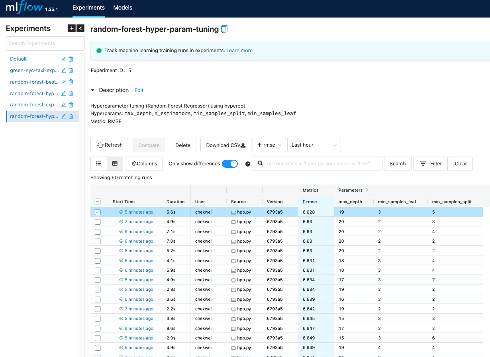
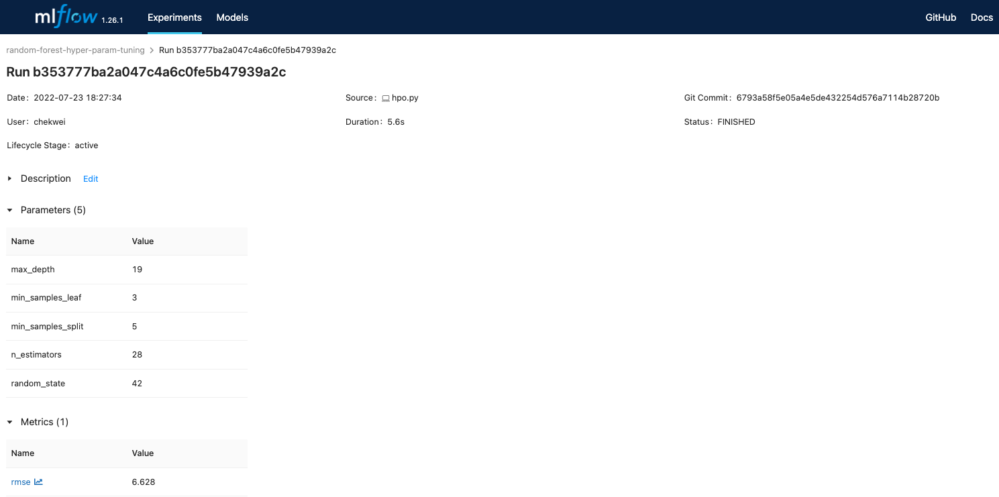
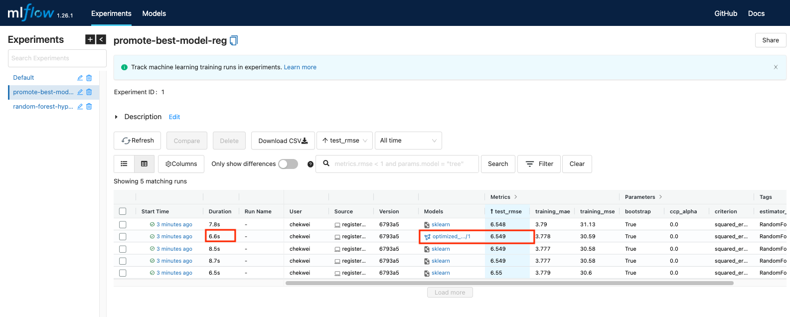
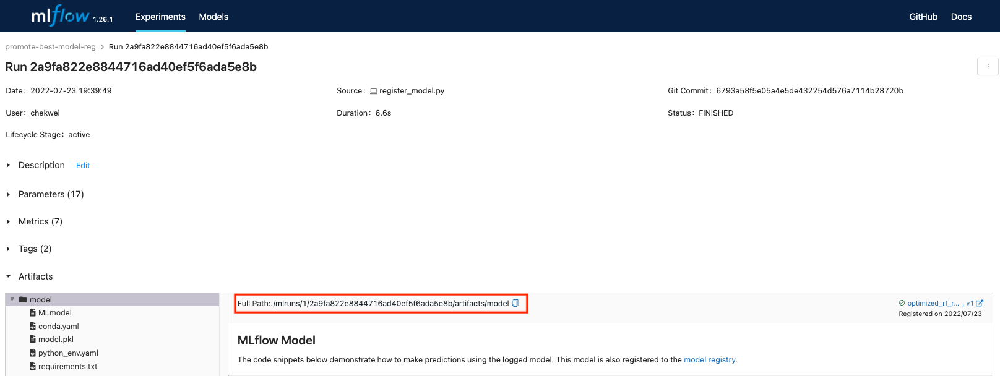

# Week 2

## Experiment Tracking
Proces of keeping tracking of all the relevant info from an ML experiment, includes:
- source code
- environment
- data
- model
- hyperparams
- metrics

### Why experiment tracking is important?
- reproducibility
- organisation
  - collaborating with different people in the team
- optimization

## Using MLflow
- An open source platform for the ML lifecycle.
- An ML experiment is the process of building an ML model
  - One experiment is basically a bunch of ML runs associated
- Experiment run: Each trial in an ML experiment
- Just a python package that can be installed with pip and contains four main modules:
  1. tracking
    - Allow u to organise your experiments into runs
    - Able to keep track params, metrics, metadata, artifacts, models
      - Metrics like accuracy, F1 score
      - Metadata includes any info related to the info. Let us search and filter the experiments easily
      - Artifacts like any visualisation files that can be logged
      - Models can be logged too
  2. models
  3. model registry
    - useful for model tracking 
  4. projects
- MLflow will auto log extra info:
  - source code
  - git commit (version of the code)
  - start, end time
  - author

## Run MLflow

```
pip install mlflow

mlflow --version
```
`mlflow, version 1.26.1`

To launch MLflow, remember to initiate with a backend DB.

```
mlflow ui --backend-store-uri sqlite:///mlflow.db
```

Within the python code, we need to import MLflow, just like any other packages. 

```python
import mlflow

mlflow.set_tracking_uri("sqlite:///mlflow.db")
mlflow.set_experiment("my-brand-new-experiment")
```
The backend DB which we initiated was `sqlite:///mlflow.db`, so we will use that as our `tracking_uri`.

Below is a sample way to log metrics, create tags, and alpha value for a linear regression experiment run. 

```python
with mlflow.start_run():

    mlflow.set_tag("developer", "cristian")

    mlflow.log_param("train-data-path", "./data/green_tripdata_2021-01.csv")
    mlflow.log_param("valid-data-path", "./data/green_tripdata_2021-02.csv")

    alpha = 0.1
    mlflow.log_param("alpha", alpha)
    lr = Lasso(alpha)
    lr.fit(X_train, y_train)

    y_pred = lr.predict(X_val)
    rmse = mean_squared_error(y_val, y_pred, squared=False)
    mlflow.log_metric("rmse", rmse)
```

## Hyperparameter Tuning with Hyperopt
In this project, a straightforward model (`Random Forest Regressor`) was deployed with the aim to perform hyperparameter tuning using Hyperopt.

The training data used was [Green Taxi Trip Records for January 2021](https://www1.nyc.gov/site/tlc/about/tlc-trip-record-data.page). 

The validation data used was [Green Taxi Trip Records for February 2021](https://www1.nyc.gov/site/tlc/about/tlc-trip-record-data.page). 

The loss function (key metric) for hyperparameter tuning was to minimize the RMSE. 

Below are the 4 hyperparamters involved in tunining and the number of parameter evaluations for the optimizers to explore is `50`:

```python
search_space = {
        'max_depth': scope.int(hp.quniform('max_depth', 1, 20, 1)),
        'n_estimators': scope.int(hp.quniform('n_estimators', 10, 50, 1)),
        'min_samples_split': scope.int(hp.quniform('min_samples_split', 2, 10, 1)),
        'min_samples_leaf': scope.int(hp.quniform('min_samples_leaf', 1, 4, 1))
    }
```

Below screenshot from MLflow was the results from running 50 evaluations:
<p align="center">
    
</p>

The best parameters and RMSE found were:
- `max_depth`: 19

- `min_samples_leaf`: 3

- `min_samples_split`: 5

- `n_estimators`: 28

- `RMSE`:  	6.628

<p align="center">
    
</p>

## Promoting Best Model to Model Registry
From above Hyperopt tuning, we have explored 50 runs and found some of the best hyperparameters that yield the lowest RMSE for validation set. 

Here, we will check through the 50 runs, choose the top 5 models that yield the best (lowest) RMSE on validation set, and run them through the test set.

The test data used was [Green Taxi Trip Records for March 2021](https://www1.nyc.gov/site/tlc/about/tlc-trip-record-data.page). 

The best model will be the one which yields the lowest RMSE on test set, and we will want to promote the model to the model registry. 


The goal here is to select the model that yields the lowest RMSE on the test set, and register it to the model registry. 

We can see that the "best" model is run `Run 2a9fa822e8844716ad40ef5f6ada5e8b` with
- `test RMSE`: 6.549
- `duration`: 6.6s

<p align="center">
    
</p>

The full path of the model artifacts can be found here `./mlruns/1/2a9fa822e8844716ad40ef5f6ada5e8b/artifacts/model`
<p align="center">
    
</p>
