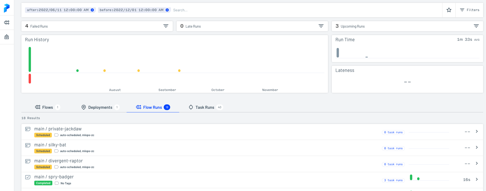

# Week 3

## Negative Engineering
Main idea behind this concept is that most of the times we spend time trying to reduce "negative things" from happening. 

Hence Prefect comes in and its goal is to reduce time and effort spent on Negative Engineering and increase productivity and efficiency. 

## Prefect
- Embracing dynamic, DAG-free workflows
- Transparent and observable orchestration rules

## Install
To install Prefect Orion beta package:
```python
pip install prefect==2.0b5
```

### Flow
Using Prefect by wrapping the codes as a workflow function. We can add the decorator `@flow` one line above the `main()` function.
```python
@flow
def main():
    train_path, val_path = get_paths(...).result()
    # rest of flow below
```

### Task
To add tasks, we can add another decorator `@task` above a function.
```python
@task
def prepare_features(df, categorical, train=True):
    df['duration'] = df.dropOff_datetime - df.pickup_datetime
    df['duration'] = df.duration.dt.total_seconds() / 60
    # rest of task below
```

### User Interface
To spin up the Prefect Orion UI:
```
prefect orion start
```
On localhost, the UI should be available at `http://127.0.0.1:4200/`

### Work-Queue
To view the available `work-queues`, we can execute below command:

```
prefect work-queue ls
```

```
                            Work Queues                             
┏━━━━━━━━━━━━━━━━━━━━━━━━━━━━━━━━━━━━━━┳━━━━━━━━┳━━━━━━━━━━━━━━━━━━━┓
┃                                   ID ┃ Name   ┃ Concurrency Limit ┃
┡━━━━━━━━━━━━━━━━━━━━━━━━━━━━━━━━━━━━━━╇━━━━━━━━╇━━━━━━━━━━━━━━━━━━━┩
│ 41025cd5-9678-4719-89bd-dfeeefd39515 │ global │ None              │
└──────────────────────────────────────┴────────┴───────────────────┘
```


To preview `work-queue`, we can execute below command:
```
prefect work-queue preview insert-id-here
```
By doing so, we can preview the list of runs/activities that are scheduled. 

```
┏━━━━━━━━━━━━━━━━━━━━━━━━━━━┳━━━━━━━━━━━━━━━━━━━━━━━━━━━━━━━━━━━━━━┳━━━━━━━━━━━━━━━━━┳━━━━━━━━━━━━━━━━━━━━━━━━━━━━━━━━━━━━━━┓
┃ Scheduled Start Time      ┃ Run ID                               ┃ Name            ┃ Deployment ID                        ┃
┡━━━━━━━━━━━━━━━━━━━━━━━━━━━╇━━━━━━━━━━━━━━━━━━━━━━━━━━━━━━━━━━━━━━╇━━━━━━━━━━━━━━━━━╇━━━━━━━━━━━━━━━━━━━━━━━━━━━━━━━━━━━━━━┩
│ 2022-09-15 13:00:00+00:00 │ 5a4834f2-0377-4ef5-b87b-da79db8b82f9 │ perky-eel       │ 760bd696-50ee-42c6-bda4-bc3ef9e2e278 │
│ 2022-08-15 13:00:00+00:00 │ 854f407a-bd72-4d7a-9b9d-810b843694fa │ berserk-chicken │ 760bd696-50ee-42c6-bda4-bc3ef9e2e278 │
│ 2022-07-15 13:00:00+00:00 │ 4f7f51b4-ebd7-44dc-9f66-b6f9479febd8 │ onyx-groundhog  │ 760bd696-50ee-42c6-bda4-bc3ef9e2e278 │
└───────────────────────────┴──────────────────────────────────────┴─────────────────┴──────────────────────────────────────┘
```

### Deployment
We can define the `DeploymentSpec` in order to deploy our codes to Prefect. Here, we can specify if we want to run the job using `IntervalSchedule` or `CronSchedule`. 

```python
from prefect.deployments import DeploymentSpec
from prefect.orion.schemas.schedules import IntervalSchedule, CronSchedule
from prefect.flow_runners import SubprocessFlowRunner

# IntervalSchedule
DeploymentSpec(
    flow=main,
    name="model_training",
    schedule=IntervalSchedule(interval=timedelta(minutes=5)),
    flow_runner=SubprocessFlowRunner(),
    tags=["ml"]
)

# CronSchedule
DeploymentSpec(
    flow=main,
    name="mlops-zc-cron-schedule-deployment",
    schedule=CronSchedule(
        cron="0 9 15 * *",
        timezone="America/New_York"),
    flow_runner=SubprocessFlowRunner(),
    tags=["mlops-zc"]
)

```
To create the deployment, we can execute below command:

```
prefect deployment create prefect_deploy.py
```

## Prefect Mini-Project 
Training ata used here is the [For-Hire-Vehicle Trip Records 2021 January and February](https://d37ci6vzurychx.cloudfront.net/trip-data/fhv_tripdata_2021-01.parquet).

The tasks created for the flow are:
- `read_data`
- `prepare_features`
- `train_model`
- `run_model`

In this project, we are creating a workflow that runs on 15th of every month, at 9AM. 

The workflow will download data from URL provided. The workflow uses the data from 2 months back as the training data and the data from the previous month as validation data.

Eg. If the date passed is "2021-03-15", the training data should be `fhv_tripdata_2021-01.parquet` and the validation file will be `fhv_trip_data_2021-02.parquet`.

Below screenshot shows that we are scheduling one run every month. The last run was successful in July, hence green in color. The next three runs (based on the date time filtering I have applied on the search bar) are labelled as "scheduled", hence orange in color. 
<p align="center">
    
</p>

Below screenshot shows what happened during the July's run.

We can see that the training and validation dataset were downloaded and ingested for training correctly. Thereafter, we can see that the MSE for validation was 11.63. 
